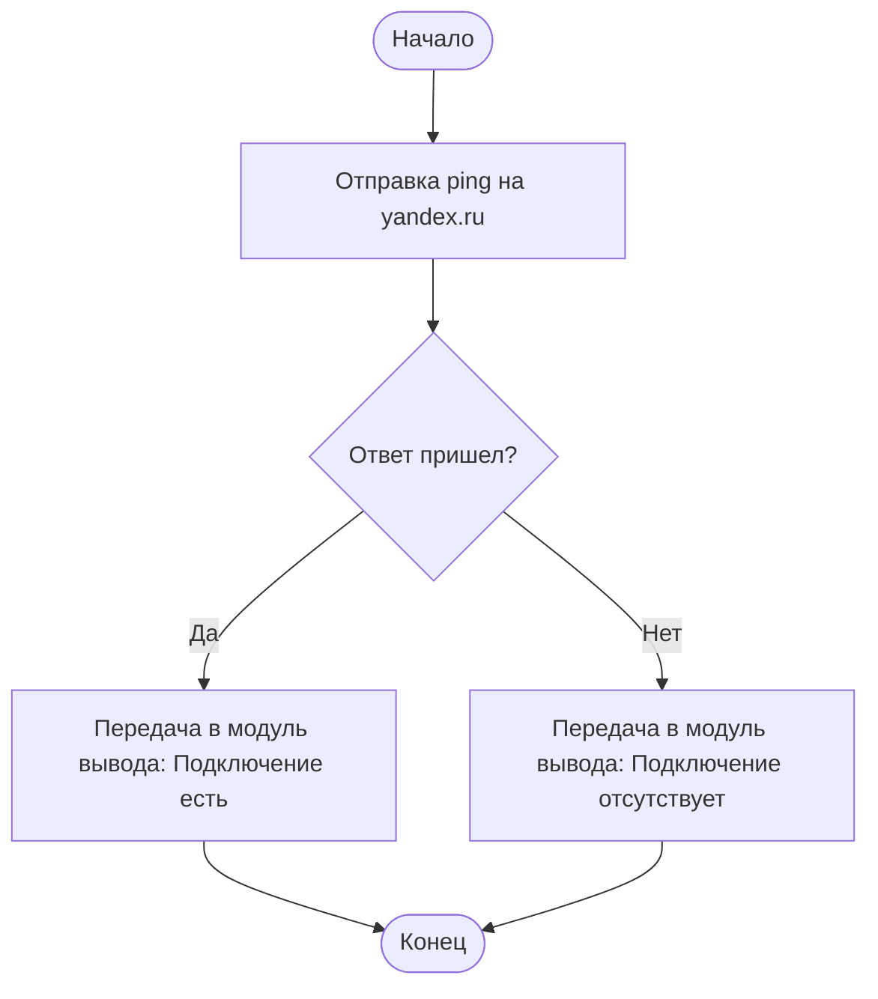
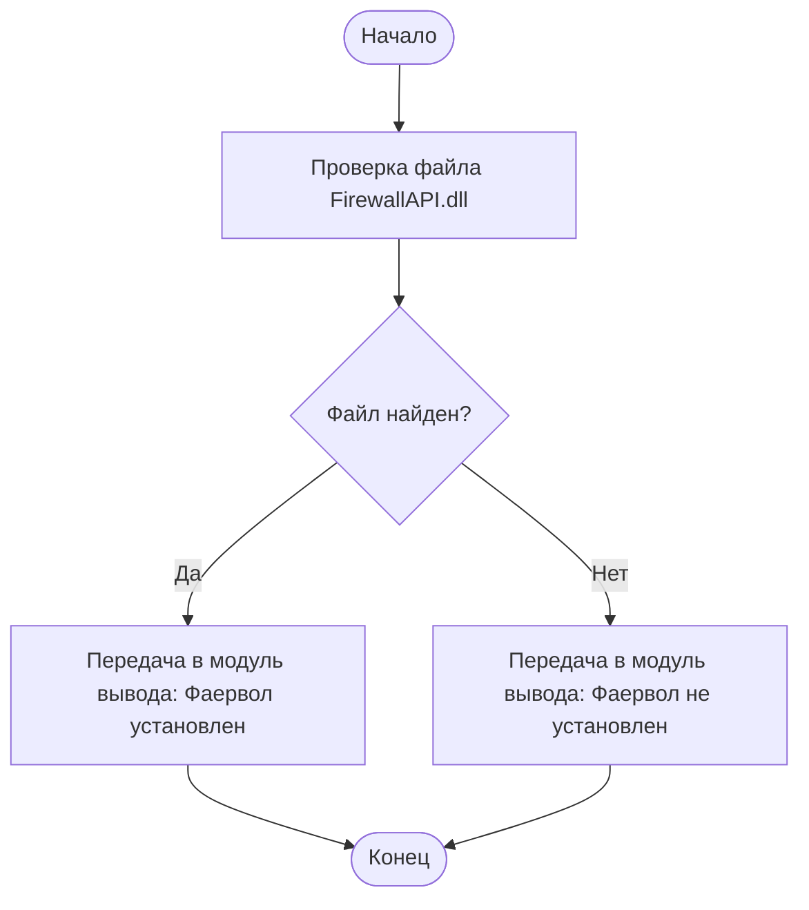
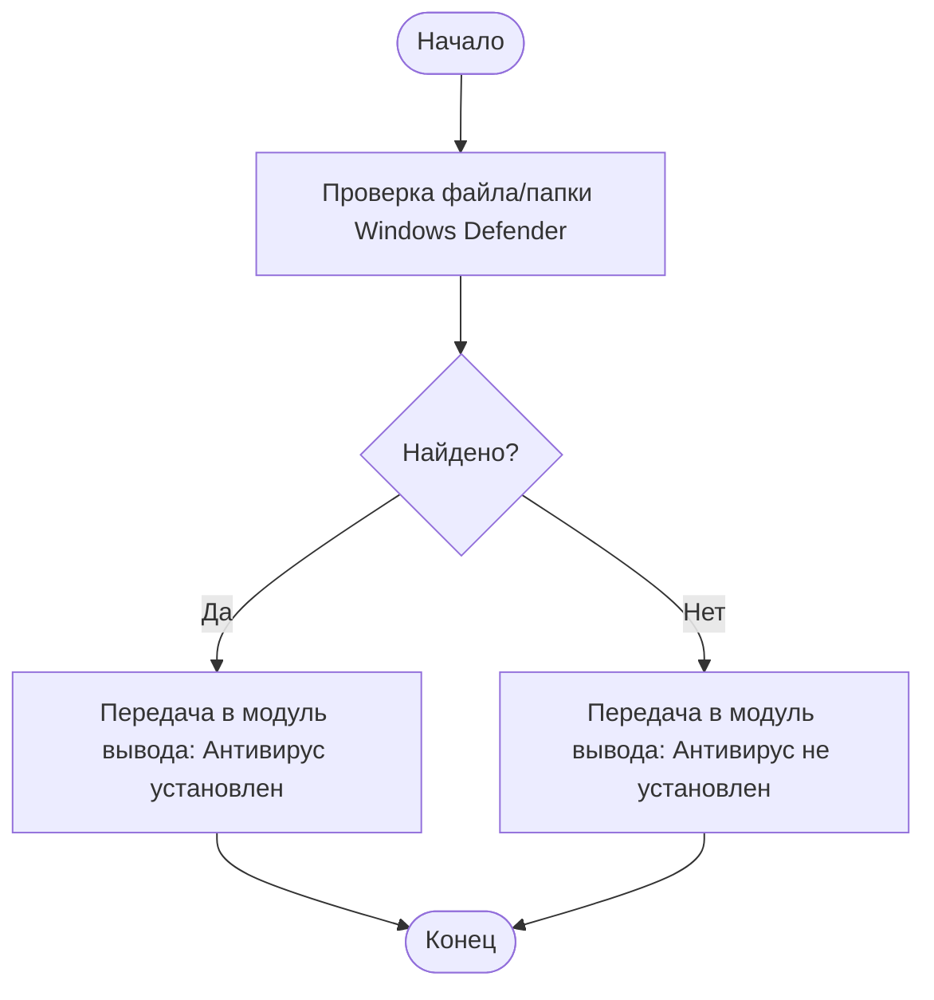
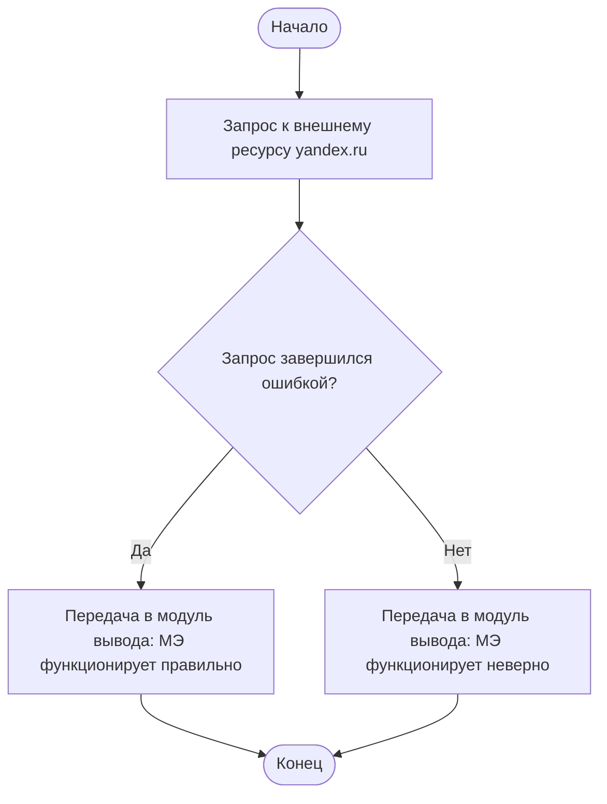
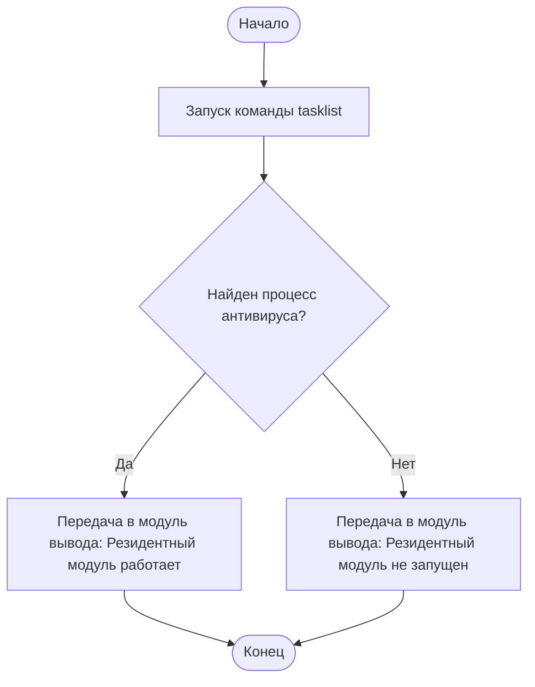
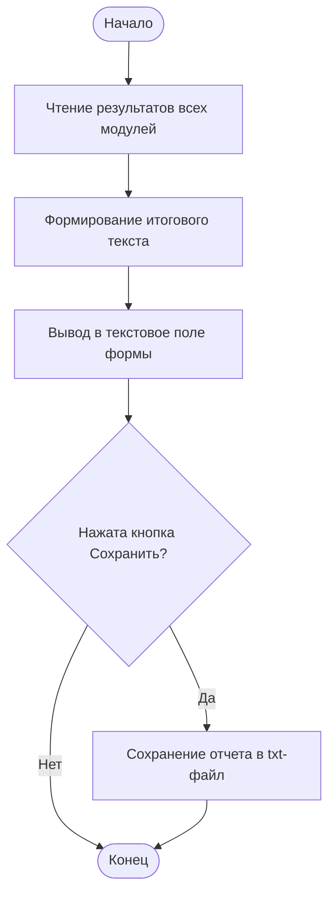

# Блок-схемы модулей курсовой работы

Ниже приведены простые блок-схемы по каждому модулю.

## 1.2. Разработка модуля проверки наличия подключения к Интернету

## 1.3. Разработка модуля проверки наличия установленного межсетевого экрана

## 1.4. Разработка модуля проверки наличия установленного антивируса

## 1.5. Разработка модуля проверки работоспособности межсетевого экрана

## 1.6. Разработка модуля проверки работоспособности антивирусного ПО

## 1.7. Разработка модуля вывода результатов

## Примечание

В курсовой работе модули межсетевого экрана и антивируса разделены:
- отдельный модуль проверки МЭ;
- отдельный модуль проверки АВ.
